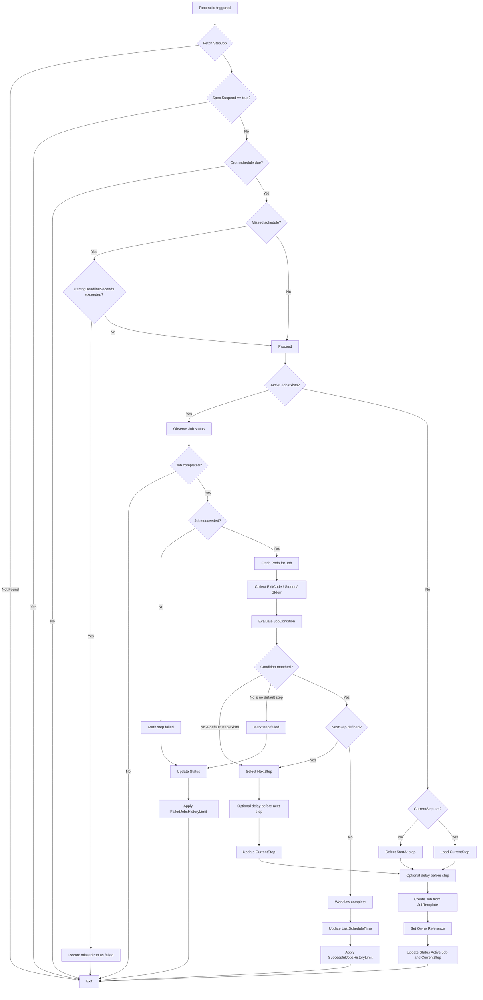

# cron-step-operator
A Kubernetes Operator for running defining step-function operations that run as k8s Jobs.

Here’s a **README draft** for your `step-job-operator` project, including **project description** and **system requirements**, based on your Go module and dependencies:

---

# Step Job Operator

## Project Description

`step-job-operator` is a Kubernetes operator built with **Kubebuilder** for managing **sequential job workflows** (StepJobs) inside a cluster. It allows you to define workflows as a series of steps, each represented by a Kubernetes `Job`. Each step can specify conditional logic to determine the next step in the workflow based on job results, including exit codes, stdout, or stderr.

Key features:

* **Sequential workflows:** Steps execute one after another; parallel fan-out is not supported.
* **Conditional branching:** Each step can define conditions to determine the next step.
* **Status tracking:** Tracks active and completed jobs in the workflow.
* **Missed schedule handling:** Optional `startingDeadlineSeconds` ensures missed runs are handled as failed.
* **History limits:** Configurable limits for successful and failed jobs to retain.

This operator is ideal for **CI/CD style pipelines, batch job orchestration, and workflow automation** within Kubernetes.

---

## System Requirements

### Kubernetes

* Kubernetes cluster **v1.30+** recommended (compatible with client-go v0.30.1)
* Cluster role with permissions to manage `Jobs`, `Pods`, and CRDs

### Go

* **Go version:** 1.22.0
* **Go toolchain:** go1.22.5

### Dependencies

The operator uses the following key dependencies:

* `sigs.k8s.io/controller-runtime v0.18.4` – Kubernetes controller framework
* `k8s.io/apimachinery v0.30.1` – Kubernetes API machinery
* `k8s.io/client-go v0.30.1` – Kubernetes client
* `github.com/onsi/ginkgo/v2 v2.17.1` – Testing framework
* `github.com/onsi/gomega v1.32.0` – Matcher library for testing

> The full list of dependencies is managed in `go.mod`.

### Tooling

* `kubebuilder` – for scaffolding controllers and CRDs
* `make` / `bash` scripts for building, running, and testing the operator

---

## Local Cluster

Quick start with a local KinD cluster `(v0.25+)`.

Optional: Ensure kubectl is installed and configured.

```bash
kind create cluster --name stepjob-demo
kubectl cluster-info --context kind-stepjob-demo
```

## Installation

1. **Install CRDs:**

```bash
make install
```

2. **Run operator locally:**

```bash
make run
```

3. **Deploy to cluster:**

```bash
make deploy
```

---

## Usage

* Define a **StepJob** CRD YAML specifying steps, job templates, and optional conditions.
* Apply the YAML to your cluster:

```bash
kubectl apply -f example-stepjob.yaml
```

* Monitor workflow progress:

```bash
kubectl get stepjob
kubectl describe stepjob <name>
```

## Sample StepJob Resource

```yaml
apiVersion: step-job-operator.kubebuilder.io/v1
kind: StepJob
metadata:
  name: example-stepjob
spec:
  # Cron schedule: run every 5 minutes
  schedule: "*/5 * * * *"

  # Step to start workflow at
  startAt: build

  # Define workflow steps
  steps:
    # --------------------------------------------------
    # Step 1: build
    # --------------------------------------------------
    - name: build
      jobTemplate:
        spec:
          template:
            spec:
              restartPolicy: Never
              containers:
                - name: build
                  image: busybox
                  command: ["sh","-c","echo Building...; exit 0"]

      # Next step if build succeeds
      next:
        - name: test
          condition:
            condition: ExitCode
            operator: Equal
            value: "0"

    # --------------------------------------------------
    # Step 2: test
    # --------------------------------------------------
    - name: test
      jobTemplate:
        spec:
          template:
            spec:
              restartPolicy: Never
              containers:
                - name: test
                  image: busybox
                  command: ["sh","-c","echo Running tests...; exit 0"]

      # Next step if tests succeed
      next:
        - name: deploy
          condition:
            condition: ExitCode
            operator: Equal
            value: "0"

    # --------------------------------------------------
    # Step 3: deploy
    # --------------------------------------------------
    - name: deploy
      jobTemplate:
        spec:
          template:
            spec:
              restartPolicy: Never
              containers:
                - name: deploy
                  image: busybox
                  command: ["sh","-c","echo Deploying...; exit 0"]

```

## Reconcile loop


## Contributing/Feedback

We welcome contributions, suggestions, and bug reports to improve Step Job Operator!

Make your changes following Go and Kubernetes controller best practices.

- Use Kubebuilder scaffolding for new controllers or CRDs.
- Follow the existing StepJob design patterns (sequential steps, JobCondition rules).
- Add unit tests using Ginkgo/Gomega.
- Follow conventions and idiomatic style.
- Ensure CRD validation annotations are properly applied.

Run tests/lint locally:
```bash
make test
make lint
```

Commit changes with clear, descriptive messages:
```bash
git commit -m "Add XYZ functionality to StepJob controller"
```

#### Reporting Issues / Feedback

Open GitHub issues for:

- Bugs
- Feature requests
- Questions about usage

Provide clear reproduction steps for any bug reports. Include your Kubernetes version, Go version, and operator logs when reporting issues.
